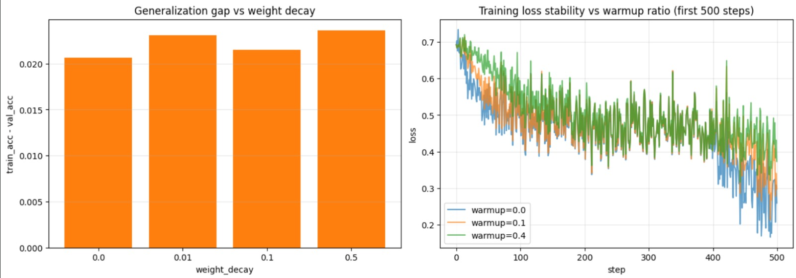

# Warmup Ratio Sensitivity Analysis

An analysis of the influence of different learning rate warmup ratios on early training loss trends during the fine-tuning phase of Stage 1.

## Experiment Configuration
- **Tested Values:** `0.0`, `0.1`, `0.4`
- **Metric Tracked:** Step-by-step training loss for the first 500 steps of the fine-tuning procedure.

## Observations

- **Noise & Variance:**
  All three configurations exhibit high variance and noise at each step, with their loss function graphs frequently intersecting.
  
- **Early Trends:**
  There appears to be a slight, albeit statistically insignificant, trend where the loss at later steps (steps ~400–500) is slightly lower for the `warmup = 0.0` configuration than for the others. However, given the high variance and the single-run nature of the experiment, this observation is not statistically definitive.
  
- **High Warmup (0.4):**
  The `warmup = 0.4` configuration did not display any major disadvantage in the first 500 steps. However, a longer warmup period could potentially restrict learning rate progression in a fixed-epoch setup, leading to underperformance in later phases.

## Early Step Loss Visualization

Below is the step-by-step training loss recorded for the first 500 steps of fine-tuning:

---

## Conclusion & Recommendation

> [!IMPORTANT]
> **Optimal Value: `0.1`**
>
> We recommend a warmup ratio of **`0.1`**. This is a standard robust choice that provides a short learning rate warmup phase (10% of total steps) to prevent early gradient instability while allowing the model enough remaining steps to train at the maximum learning rate.
